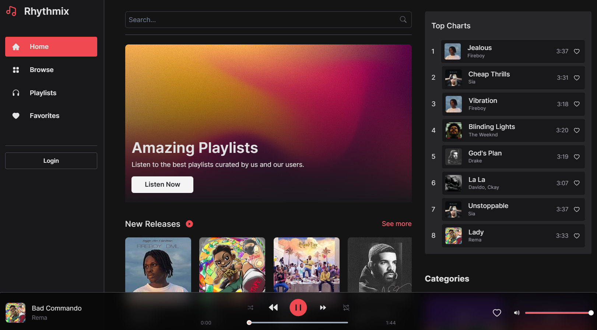

# 🎵 Rhythmix Music 🎶 
### Your Personalized Music Companion  

  

---

## 🌟 Live Demo  
Experience Rhythmix Music now!  
**[➡️ Try the Live Demo](https://rhythmix-music-player.vercel.app/home)**  

---

## 📖 About Rhythmix  
Rhythmix Music is a modern and dynamic music streaming application that allows users to:  
- 🎧 Listen to their favorite tracks seamlessly.  
- ❤️ Save music to their accounts for quick access.  
- 📋 Create, manage, and enjoy custom playlists.  

Whether you're a casual listener or a passionate music lover, Rhythmix has got you covered!  

---

## 🚀 Key Features  
- **User-Friendly Interface:** Built with **Chakra UI**, ensuring an aesthetically pleasing and responsive design.  
- **Custom Playlists:** Create, save, and enjoy personalized playlists effortlessly.  
- **State Management:** Seamless experience powered by **Redux Toolkit**.  
- **Robust Backend:** Built on **Node.js** and **Express.js** for efficient performance.  
- **Secure Database:** Managed with **MongoDB** for safe and structured storage of user data.  

---

## 🛠️ Technologies Used  

Rhythmix Music is built on the powerful **MERN Stack**:  
- **Frontend:** `React.js` | `Chakra UI` | `Redux Toolkit`  
- **Backend:** `Node.js` | `Express.js`  
- **Database:** `MongoDB`  

---

## 📸 Screenshots  
### 🎉 Home Screen  
Explore trending tracks, curated playlists, and user favorites.  
  

*(Add more screenshots for other features like playlists, account settings, etc.)*  

---

**Thank you for choosing Rhythmix Music! Keep vibing!** 🎵🎶  

